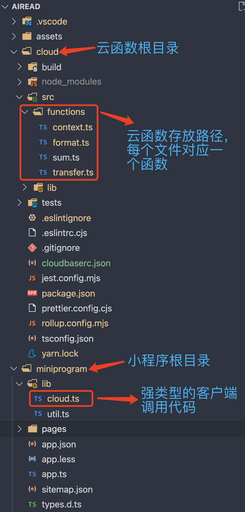
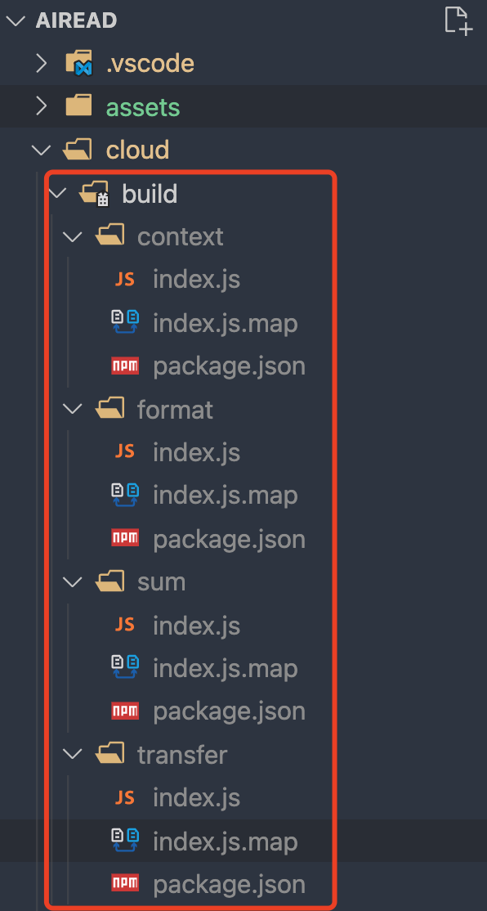
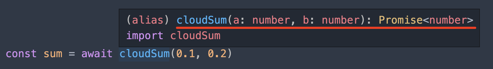
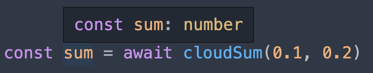

# TypeScript 小程序 & TypeScript 云函数开发模板

微信小程序开发，已经直接支持 `TypeScript`，但新出的「云函数」仍然不支持 `TypeScript`，这令热爱 `TypeScript` 的我，颇感不方便。

`TypeScript` 强大的类型能力令人沉醉，我想要的效果是：

- 根据云函数代码，自动生成强类型的客户端调用代码。
- 一个工程，一个 `package.json`，通过编译自动生成多个独立的云函数。

我们先大致说一下最终实现出来的效果，后面再说如何实现。

## 初始化

建议你从 fork 我的代码开始，该工程的源在：

https://github.com/lip8up/typed-wx-miniprogram-with-cloud

镜像在：

https://gitee.com/lip8up/typed-wx-miniprogram-with-cloud

## 目录结构

先说说源码的目录结构：



`functions` 里的代码，编译后，将形成以下目录结构：



> 当然，如果你的函数比较复杂，需要多个文件，可以在 `functions` 下，创建一个子目录，该子目录的名字，就是你的云函数名字，子目录中创建一个 `index.ts` 作为入口函数，其他文件都放在该目录下。

也可以将一些工具类的函数，放在其他目录，然后在主函数中引用，编译工具，会处理引用关系，确保每个函数都可独立运行。

当然，上述目录结构，是通过根目录下的 `project.config.json` 进行配置的，你可以根据需要进行修改：

```json
{
  "miniprogramRoot": "miniprogram/",
  "cloudfunctionRoot": "cloud/build/",
  "cloudfunctionTemplateRoot": "cloud/.template",
}
```

## 包依赖

最终上传的是 `build` 目录下的函数，每个函数，均含有各自的 `package.json`，并且其 `dependencies` 字段仅仅包含每个函数实际需要的，不会多包含。

举例来说，本示例项目，被各个函数共享使用的 `cloud/package.json` 中，`dependencies` 字段的值为：

```json
"dependencies": {
  "cheerio": "^1.0.0-rc.10",
  "got": "^11.8.2",
  "iconv-lite": "^0.6.3",
  "wx-server-sdk": "^2.5.3"
}
```

`context`、`format`、`sum` 等函数比较简单，只依赖 `wx-server-sdk` 包，以 `sum` 为例，其 `package.json` （`cloud/build/sum/package.json`）为：

```json
{
  "name": "sum",
  "version": "1.0.0",
  "description": "",
  "author": "lip8up <lip8up@qq.com>",
  "license": "MIT",
  "dependencies": {
    "wx-server-sdk": "^2.5.3"
  }
}
```

而 `transfer` 依赖 `cheerio`、`got`、`iconv-lite`、`wx-server-sdk` 四个包，其 `package.json`（`cloud/build/transfer/package.json`）为：

```json
{
  "name": "transfer",
  "version": "1.0.0",
  "description": "",
  "author": "lip8up <lip8up@qq.com>",
  "license": "MIT",
  "dependencies": {
    "got": "^11.8.2",
    "iconv-lite": "^0.6.3",
    "cheerio": "^1.0.0-rc.10",
    "wx-server-sdk": "^2.5.3"
  }
}
```

这里我们先简单说一下，后面再详述如何实现。

## 云函数代码

我们以 `sum` 为例，其内容非常简单：

```ts
// cloud/src/functions/sum.ts
export default (a: number, b: number) => {
  return a + b
}
```

可以看到，使用了 `export default`，使用的也是 `es module` 格式，而云函数，要求导出 `main` 函数，并且使用 `commonjs` 的格式。

别着急，我写的编译工具，要求你直接写 `export default`，剩下的编译工具来处理，如上面的代码，被编译工具处理后，形成如下代码（`cloud/build/sum/index.js`）：

```js
'use strict';

//~~** This code was generated by rollup-plugin-wx-cloud, please DO NOT EDIT it. **~~

Object.defineProperty(exports, '__esModule', { value: true });

var cloud_1 = require('wx-server-sdk');

function _interopDefaultLegacy (e) { return e && typeof e === 'object' && 'default' in e ? e : { 'default': e }; }

var cloud_1__default = /*#__PURE__*/_interopDefaultLegacy(cloud_1);

const default_1 = (a, b) => {
    return a + b;
};
cloud_1__default["default"].init({ env: cloud_1__default["default"].DYNAMIC_CURRENT_ENV });
async function main(event) {
    return default_1(event.a, event.b);
}

exports.main = main;
//# sourceMappingURL=index.js.map
```

可以看到 `export default` 被编译掉了，取而代之，增加了一个 `async function main` 函数，并且使用 `commonjs` 的方式导出它 `exports.main = main;`。

编译工具发现你的原有代码中，没有对 `wx-server-sdk` 进行初始化，会替你初始化：

```js
var cloud_1 = require('wx-server-sdk');
var cloud_1__default = /*#__PURE__*/_interopDefaultLegacy(cloud_1);
`cloud_1__default["default"].init({ env: cloud_1__default["default"].DYNAMIC_CURRENT_ENV })`

// 上面是编译后的代码，对应的源码为：
import cloud from 'wx-server-sdk'
cloud.init({ env: cloud.DYNAMIC_CURRENT_ENV })
```

> 如果你进行了初始化，它就不会再做多余的初始化操作。

## 客户端代码

再看一下强类型的客户端调用代码文件 `miniprogram/lib/cloud.ts` 的内容，原谅我直接上一段大代码，大家先粗略看一下，看不懂也不要紧（能看懂也不要对我撇嘴😒），有一个大概的印象，下面会一步步展开讲述：

```ts
//~~** This code was generated by rollup-plugin-wx-cloud, please DO NOT EDIT it. **~~
import type { main as functionContext } from '@cloud/functions/context'
import type functionFormat from '@cloud/functions/format'
import type functionSum from '@cloud/functions/sum'
import type functionTransfer from '@cloud/functions/transfer'

type PromiseType<T> = T extends Promise<infer _> ? T : Promise<T>

type PromiseReturnType<T extends (...args: any) => any> = (...args: Parameters<T>) => PromiseType<ReturnType<T>>

export const cloudContext = (data?: any): PromiseType<ReturnType<typeof functionContext>> => {
  return wx.cloud.callFunction({ name: 'context', data }).then(res => res.result as any)
}

export const cloudFormat: PromiseReturnType<typeof functionFormat> = json => {
  return wx.cloud.callFunction({ name: 'format', data: { json } }).then(res => res.result as any)
}

export const cloudSum: PromiseReturnType<typeof functionSum> = (a, b) => {
  return wx.cloud.callFunction({ name: 'sum', data: { a, b } }).then(res => res.result as any)
}

export const cloudTransfer: PromiseReturnType<typeof functionTransfer> = url => {
  return wx.cloud.callFunction({ name: 'transfer', data: { url } }).then(res => res.result as any)
}

export default {
  context: cloudContext,
  format: cloudFormat,
  sum: cloudSum,
  transfer: cloudTransfer
}
```

### 别名

`@cloud` 是在项目根目录下的 `tsconfig.json` 配置的别名，指向 `cloud/src/*`：

```json
{
  "compilerOptions": {
    // ...
    "baseUrl": ".",
    "paths": {
      "@cloud/*": [
        "cloud/src/*"
      ]
    }
  },
  "include": [
    "./**/*.ts"
  ],
  "exclude": [
    "node_modules"
  ]
}

```

> 目前，微信官方仍不支持使用别名（除非使用预处理构建），好在该别名只用作 `import type`，编译后并不会出现在编译后的结果文件中。

### 举例分析

我们仍以 `sum` 为例，其代码再看一遍：

```ts
// cloud/src/functions/sum.ts
export default (a: number, b: number) => {
  return a + b
}
```

生成的客户端访问代码为：

```ts
import type functionSum from '@cloud/functions/sum'

export const cloudSum: PromiseReturnType<typeof functionSum> = (a, b) => {
  return wx.cloud.callFunction({ name: 'sum', data: { a, b } }).then(res => res.result as any)
}
```

可以看到，核心是 `PromiseReturnType`，见名知意，它将一个函数类型的返回值 Promise 化。

举例来说，上面的 `sum` 函数的类型（即 `typeof functionSum` 的结果）为：

```ts
(a: number, b: number) => number
```

经过 `PromiseReturnType<typeof functionSum>` 后，变为：

```ts
(a: number, b: number) => Promise<number>
```

为什么要做这种变换呢？

很显然，客户端调用云函数，肯定都是异步的呀，所以要用异步函数。

> 如果函数本身的返回值就是 Promise<T> 呢，PromiseReturnType 考虑到了这种情况，不会出现 Promise<Promise<T>> 这样的结果。
>
> 其实，即便使用了 Promise<Promise<T>>，也不影响最终的使用效果，这是由 Promise 的特性决定的。

知道了 `PromiseReturnType` 的作用，下面的函数体，就好理解多了：

```ts
export const cloudSum: PromiseReturnType<typeof functionSum> = (a, b) => {
  return wx.cloud.callFunction({ name: 'sum', data: { a, b } }).then(res => res.result as any)
}
```

由于已经为 `cloudSum` 标注了类的型 `(a: number, b: number) => Promise<number>`，参数 `(a, b)` 中的 `a` 与 `b` 自动获得 `number` 类型，不用重复标注。

函数体中调用 `wx.cloud.callFunction`，传入 `name` 为 `sum`，这是云函数的名字。传入 `data` 为 `{ a, b }`，这是传给云函数的参数，最终会被云函数的第一个参数（通常名为 `context`）接收，参考上面的云函数 `sum` 编译后的代码：

```js
const default_1 = (a, b) => {
    return a + b;
};
async function main(event) {
    return default_1(event.a, event.b);
}
```

而最后的 `.then(res => res.result as any)`，则是对云函数的调用结果进行提取。转换成 `any`，确保编译器不会报类型转换错误。

### 怎么使用？

```ts
// 导入，使用相对路径，目前官方尚未默认支持 TypeScript 别名：
import { cloudSum } from '../../lib/cloud'

// 在某个 async 函数内：
const sum = await cloudSum(0.1, 0.2)
console.log({ sum })

// 或者在非 async 函数内：
cloudSum(0.1, 0.2).then(sum => console.log({ sum }))
```

将鼠标放在 `cloudSum` 上，`vscode` 会给你强类型的提示：



将鼠标放在返回值 `sum` 上，`vscode` 也会给你强类型的提示：



你以为只有这些？看动画：


### PromiseReturnType 原理

> 不想了解 `TypeScript` 高级用法的可以跳过该节。

查看生成的 `miniprogram/lib/cloud.ts`，会发现有两个 `TypeScript` 泛型类型：

```ts
type PromiseType<T> = T extends Promise<infer _> ? T : Promise<T>

type PromiseReturnType<T extends (...args: any) => any> = (...args: Parameters<T>) => PromiseType<ReturnType<T>>
```

先看 `PromiseType<T>`，它等于：

```ts
T extends Promise<infer _> ? T : Promise<T>
```

`T extends U ? X : Y` 这种形式，在 `TypeScript` 中被称为「条件类型」，意思是：

> 如果 T 扩展自 U，那么取类型 X，否则取类型 Y。

那么 `T extends Promise<infer _> ? T : Promise<T>` 的结果就好理解了，如果 T 扩展自 Promise，那么就取 T（此时，T 本身就是 Promise 的），否则就用 Promise<T> 把它包装一下，使其成为 Promise，确保其始终为 Promise。

至于 `Promise<infer _>` 中的 `infer _`，`infer` 的含义见下面，`_` 的意思是，我不关心 `Promise<SomeType>` 中的 `SomeType`，省略就行。

> infer 相当于在类型推断中，定义了一个临时变量，类似于 C# LINQ 中的 let 表达式，更详细的讲解，请参见：https://jkchao.github.io/typescript-book-chinese/tips/infer.html。

再看 `PromiseReturnType<T>`，其定义为：

```ts
type PromiseReturnType<T extends (...args: any) => any> = (...args: Parameters<T>) => PromiseType<ReturnType<T>>
```

一点点分析，类型参数 `T extends (...args: any) => any` 的意思是：T 必须为函数。

`Parameters<T>` 是 `TypeScript` 的内置库类型，功能为：取函数 T 的参数列表。

`ReturnType<T>` 也是 `TypeScript` 的内置库类型，功能为：取函数 T 的返回值类型。

整个表达式：`(...args: Parameters<T>) => PromiseType<ReturnType<T>>` 的作用为：
> 定义一个新函数，取函数 T 的参数列表，作为它的参数列表，取 T 的返回值类型，使用 `PromiseType` 进行 `Promise` 化一下，作为它的返回值类型。

### 深入了解

大家可以看一下两个内置库类型的实现，挺有意思，注意看 `infer` 的位置：

```ts
/**
 * Obtain the parameters of a function type in a tuple
 */
type Parameters<T extends (...args: any) => any> = T extends (...args: infer P) => any ? P : never;

/**
 * Obtain the return type of a function type
 */
type ReturnType<T extends (...args: any) => any> = T extends (...args: any) => infer R ? R : any;
```

## 如何实现？

> 从本节开始，一步步介绍如何实现上述方案。

### 选择编译系统

要将 `TypeScript` 编译成 `JavaScript`，`TypeScript` 的官方编译器 `tsc` 就可以实现，但它不够灵活，这里我们选 `rollup`，配合 `@rollup/plugin-typescript` 来完成。

## 基本配置

